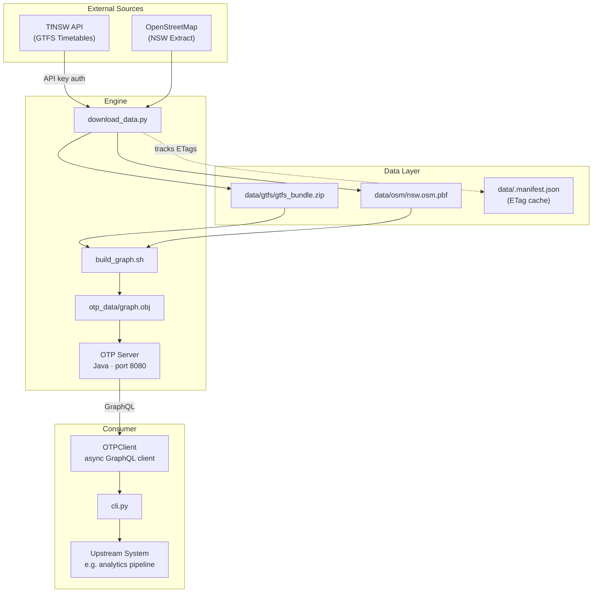
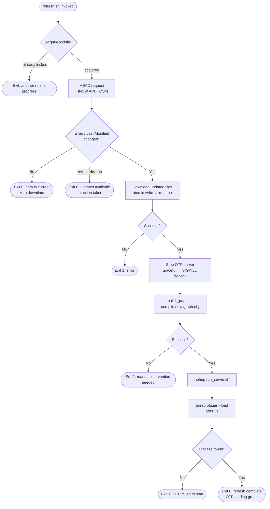

# NSW Local Commute Calculator

A local routing engine for New South Wales public transport. Uses OpenTripPlanner (OTP) to calculate commutes entirely on your own machine — bypassing all TfNSW API rate limits and enabling massive parallel processing.

## Architecture



## Features

- **Zero rate limits** — routing runs locally once the graph is built
- **Multimodal** — Trains, Metro, Buses, Light Rail, Ferries, Walking
- **True station filtering** — search/list filtered to Rail/Metro, matching official TfNSW behaviour
- **Stay-on-board merging** — continuous train segments merged into single legs
- **ETag-aware refresh** — only downloads data when upstream has actually changed

---

## Quick Start

> **Prerequisites:** Python 3.10+, Java 17+, 16GB+ RAM, [TfNSW API key](https://opendata.transport.nsw.gov.au/)

```bash
# 1. Create and activate a virtual environment
python -m venv venv && source venv/bin/activate

# 2. Install dependencies
pip install -r requirements.txt

# 3. Configure your API key
cp .env.example .env   # then edit .env and add your TFNSW_API_KEY

# 4. Download GTFS timetables + NSW OSM map (~600MB total)
python scripts/download_data.py

# 5. Build the OTP transit graph (takes 5–10 min → produces otp_data/graph.obj)
./scripts/build_graph.sh

# 6. Start the routing server (keep this terminal open)
./scripts/run_server.sh
```

### Environment Variables (`.env`)

| Variable | Default | Description |
|---|---|---|
| `TFNSW_API_KEY` | — | TfNSW Open Data API key (required for download only) |
| `OTP_MEMORY` | `12G` | Java heap for **running** the OTP server |
| `OTP_BUILD_MEMORY` | `12G` | Java heap for **building** the transit graph |

---

## CLI Reference

Open a second terminal and set the Python path:

```bash
export PYTHONPATH=src
```

### Route Planning

**Coordinates → station ID (depart at):**
```bash
python src/nsw_commute/cli.py \
  --from-lat -33.8221 --from-lon 151.0179 \
  --to-id "1:200060" \
  --date 2026-04-07 --time 07:30
```

**Station → station (arrive by):**
```bash
python src/nsw_commute/cli.py \
  --from-id "1:215010" --to-id "1:200030" \
  --date 2026-04-07 --time 09:00 --arrive-by
```

### Station Discovery

**Search by name** (Rail/Metro only):
```bash
python src/nsw_commute/cli.py --search "Central"
```

**List all Rail/Metro parent stations:**
```bash
python src/nsw_commute/cli.py --list
```

All commands output structured JSON.

---

## Automated Refresh

TfNSW updates GTFS timetables **daily overnight (AEST)**. The refresh script keeps your local graph current automatically.

### How It Works



### Manual Refresh

```bash
# GTFS-only refresh (daily — skips slow OSM download)
./scripts/refresh.sh

# Full refresh including OSM map data (weekly)
./scripts/refresh.sh --include-osm

# Check for upstream changes without downloading anything
./scripts/refresh.sh --dry-run
```

### Scheduled Refresh (Cron)

```bash
crontab -e
```

Add the following (see `crontab.example` for a ready-to-paste block):

```cron
# Daily GTFS refresh at 3:00 AM AEST
0 3 * * * cd /home/shannon/Workspace/playground/tfnsw && ./scripts/refresh.sh >> logs/refresh.log 2>&1

# Weekly OSM + GTFS refresh (Sunday 2:00 AM AEST)
0 2 * * 0 cd /home/shannon/Workspace/playground/tfnsw && ./scripts/refresh.sh --include-osm >> logs/refresh.log 2>&1
```

### Logs

```bash
tail -50 logs/refresh.log      # refresh pipeline activity
tail -f logs/otp_server.log    # live OTP server output
```

---

## Development

### Running Tests

```bash
PYTHONPATH=src ./venv/bin/pytest tests/ -v
```

### Project Structure

```
tfnsw/
├── scripts/
│   ├── download_data.py   # ETag-aware GTFS + OSM downloader
│   ├── build_graph.sh     # Compile OTP transit graph
│   ├── run_server.sh      # Start OTP server
│   └── refresh.sh         # End-to-end automated refresh pipeline
├── src/nsw_commute/
│   ├── client.py          # Async OTP GraphQL client
│   └── cli.py             # Command-line interface
├── tests/
│   └── test_client.py     # Unit tests (mocked HTTP)
├── data/                  # Downloaded GTFS + OSM (gitignored)
├── otp_data/              # Compiled graph.obj (gitignored)
├── logs/                  # Runtime logs (gitignored)
├── .env.example           # Environment variable template
└── crontab.example        # Ready-to-use cron schedule
```
